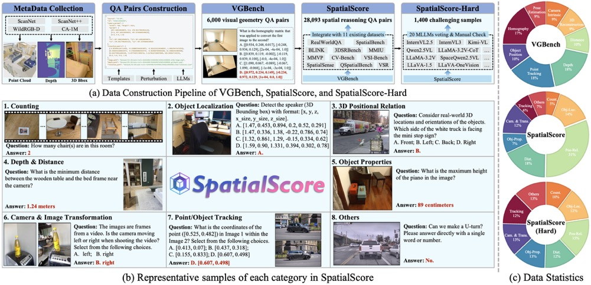

# SpatialScore: Towards Unified Evaluation for Multimodal Spatial Understanding
This repository contains the official PyTorch implementation of SpatialScore: https://arxiv.org/abs/2505.17012/.

We have open-sourced our VGBench, SpaitalScore, and inference code supporting Qwen2.5VL and InternVL.
And we are still organizing our data and code, and expect to open-source the left of them within 1-2 weeks! 
Please stay tuned! Feel free to reach out for discussions!

<div align="center">
   
</div>

## Some Information
[Project Page](https://haoningwu3639.github.io/SpatialScore/) $\cdot$ [Paper](https://arxiv.org/abs/2505.17012/) $\cdot$ [Dataset](https://huggingface.co/datasets/haoningwu/SpatialScore)

## News
- [2025.5] We have released code of evaluation with Qwen2.5VL and InternVL, and will gradually update other scripts.
- [2025.5] We have released VGBench and SpatialScore, which are available on [Huggingface](https://huggingface.co/datasets/haoningwu/SpatialScore).
- [2025.5] Our pre-print paper is released on arXiv.

## Requirements
- Python >= 3.10 (Recommend to use [Anaconda](https://www.anaconda.com/download/#linux) or [Miniconda](https://docs.conda.io/en/latest/miniconda.html))
- [PyTorch >= 2.5.1](https://pytorch.org/)
- accelerate == 1.5.2
- triton == 3.2.0
- transformers == 4.51.3 (4.49.0 is recommended for Cambrian, SpaceLLaVA, and SpatialBot models)

A suitable [conda](https://conda.io/) environment named `SpatialScore` can be created and activated with:

```
conda env create -f environment.yaml
conda activate SpatialScore
```

## Dataset
Please check out [SpaitalScore](https://huggingface.co/datasets/haoningwu/SpatialScore) to download our proposed benchmark, including `VGBench` and `SpatialScore`.

If you cannot access Huggingface, you can use [hf-mirror](https://hf-mirror.com/) to download models.

```
export HF_ENDPOINT=https://hf-mirror.com # Add this before huggingface-cli download
```

You can follow the commands below to prepare the data:

```
huggingface-cli download --resume-download --repo-type dataset haoningwu/SpatialScore --local-dir ./ --local-dir-use-symlinks False
unzip SpatialScore.zip
```

## Evaluation
Considering the current mainstream model architectures, we have prioritized support for the Qwen2.5VL and InternVL series models (All-in-one script supporting all other models will be updated soon). 
You can evaluate them on SpatialScore using the following commands:

```
CUDA_VISIBLE_DEVICES=0,1 python test_qwen.py --model_name qwen2_5vl-7b --model_path ./huggingface/Qwen2.5-VL-7B-Instruct --dataset_json_path ./dataset/SpatialScore.json --dataset_name all --output_dir ./eval_results

CUDA_VISIBLE_DEVICES=0,1 python test_qwen.py --model_name internvl3-8b --model_path ./huggingface/InternVL3-8B --dataset_json_path ./dataset/SpatialScore.json --dataset_name all --output_dir ./eval_results
```

To be updated soon...

## Inference with SpatialAgent
We have initialized some basic codes of our SpatialAgent, for example, the expert tools we adopt.
And we will update the agent system and inference code soon.

To be updated soon...

## Citation
If you use this code and data for your research or project, please cite:

	@article{wu2025spatialscore,
      author    = {Wu, Haoning and Huang, Xiao and Chen, Yaohui and Zhang, Ya and Wang, Yanfeng and Xie, Weidi},
      title     = {SpatialScore: Towards Unified Evaluation for Multimodal Spatial Understanding},
      journal   = {arXiv preprint arXiv:2505.17012},
      year      = {2025},
    }

## TODO
- [x] Release Paper
- [x] Release Dataset (VGBench, SpatialScore)
- [ ] Release SpatialScore-Hard
- [ ] Release Code of Data Construction
- [x] Release Code of Evaluation with Qwen2.5VL
- [x] Release Code of Evaluation with InternVL
- [ ] Release Code of Evaluation with all models in one script
- [x] Release Base Code of SpatialAgent
- [ ] Release Inference Code of SpatialAgent

## Acknowledgements
Many thanks to the code bases from [transformers](https://github.com/huggingface/transformers) and [TACO](https://github.com/SalesforceAIResearch/TACO).


## Contact
If you have any questions, please feel free to contact haoningwu3639@gmail.com.
